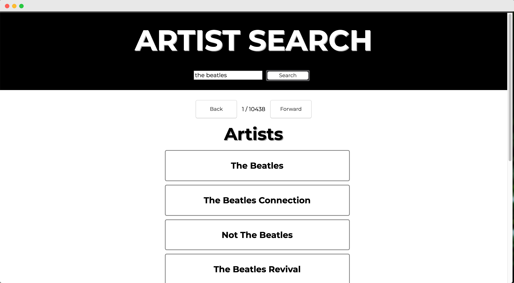

# Artist Search App
## February 28, 2019

This is a React app that allows users to search for various artists via the MusicBrainz API. The search page displays their list of results-- if there are more than 10 results, users are able to page through the results to access the next offset. Once they find the correct artist, users can click on that artist to see a list of that artist's songs. If they so choose, they can click on a specific song to see that song's lyrics via the Lyrics.ovh API.

### Run the Build
*npm run build*

### Start the App on Local Host
*npm run start*

